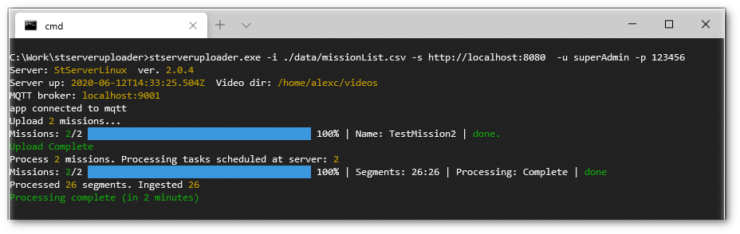

# stserveruploader
**StServer** mission uploader  
In addition to manual mission creation, it is possible to automate the process and upload large number of content file (available locally or uploaded from remote).




## OS
- Windows (64 bit)
- Linux (64 bit)


## StServerUploader usage

### Windows

```
stserveruploader.exe -i ./data/missionList.csv -s http://localhost:8080  -u superAdmin -p 123456
```

### Linux

```
./stserveruploader.run -i ./data/missionList.csv -s http://localhost:8080  -u superAdmin -p 123456
```


### Arguments

| Flag     |      Name           | Description 								                   |
|:---------|:--------------------|:-----------------------------------------------------|
| -i       |  --input            | Input configuration file path                        |
| -s       |  --server           | Server url                                           |
| -u       |  --user             | User name                                            |
| -p       |  --password         | Password                                             |
|          |  --printUsage       | Print args description (true/false)                  |


Configuration file (.csv or json) provides a list of missions to be created and the location of the content to upload.

Upload utility will first check the local machine and upload, if found. If not, just pass the path, so the server would try to locate it at its end.

## Data format
**StServerUploader** supports 2 text formats:
- json
- csv

### JSON configuration file format
**Json** configuration is an array of missions, where every mission can have an array of sensors.  
For example:
```json
[
    {
      "name": "TestMission",
      "description": "Test",        
      "usergroups": [
        "Demo"
      ],
      "platform": {
        "presentation": {
          "icon": "glyphicon-picture",
          "color": "#004dcf",
          "weight": 2
        },
        "type": "Plane",
        "name": "Platform"
      },
      "country_name": "United States",
      "country_code": "US",
      "sensors": [
        {
          "hlsProps": {
            "segmentDuration": 10,   
          },
          "type": "video",
          "views": 0,
          "tags": ['Test'],
          "name": "EO-IR",
          "description": "Sensor",      
          "assets": [
            "/home/alexc/videos/Test.ts"
          ]
        }
      ],
      "rating": 2,
      "tags": [
        "Test"
      ],
      "sortOrder": 2000
    }
]
 ```

### CSV configuration file format
**CSV** configuration is essentially a flat text representation of missions (like in json format), where every mission can have multiple sensors. In order to express the hierarchical nature of **json**, a "." (1dot) prefix is used. First line represents the fields.  
For example:

```csv
Mission._id,Mission.name,Mission.description,Mission.sortOrder,Mission.tags,Mission.usergroups,Mission.platform.name,Mission.platform.type,Mission.securityClassification,Mission.sensors.0.name,Mission.sensors.0.description,Mission.sensors.0.type,Mission.sensors.0.tags,Mission.sensors.0.sampling,Mission.sensors.0.assets
,TestMission,Test Mission, 100, "flight,test","Demo, Group1",Heron,Plane,UNCLASSIFIED,EO/IR,Main EO/IR,video,camera,200,D:/Movie/ArcGIS/Truck.ts
,TestMission2,Test Mission2,200,"flight,test","Demo, Group1",Heron,Plane,UNCLASSIFIED,EO/IR,Main EO/IR,video,camera,200,D:\Movie\DeadSea-1-1080p-6M-A.ts
```

### Platform options:

Platform type can be one of the following:
- 'Plane'
- 'Helicopter'
- 'Quadcopter'
- 'Camera'
- 'ROV'
- 'Diver'

 default: 'Plane'


© IMPLEOTV SYSTEMS LTD, 2021.